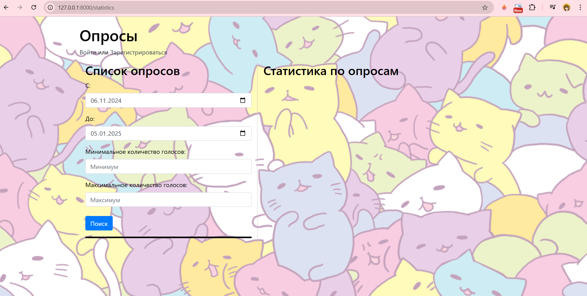
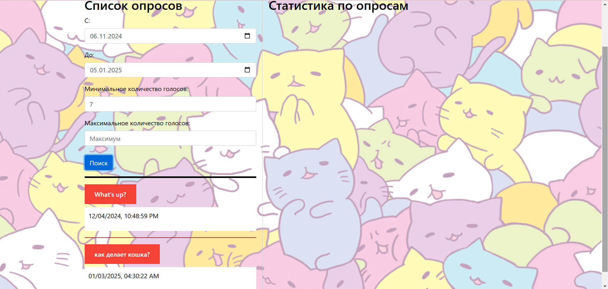
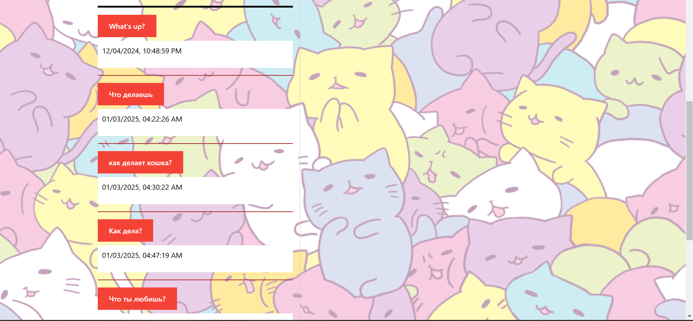
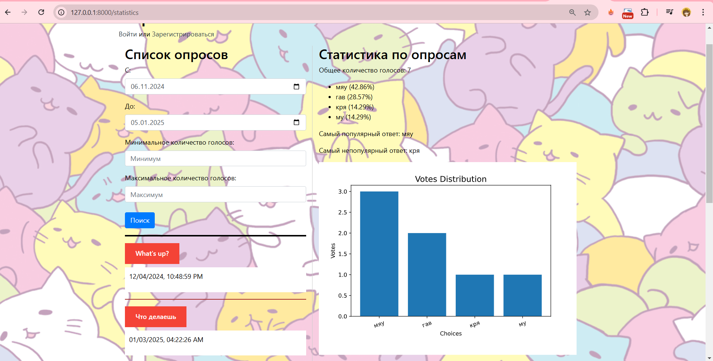
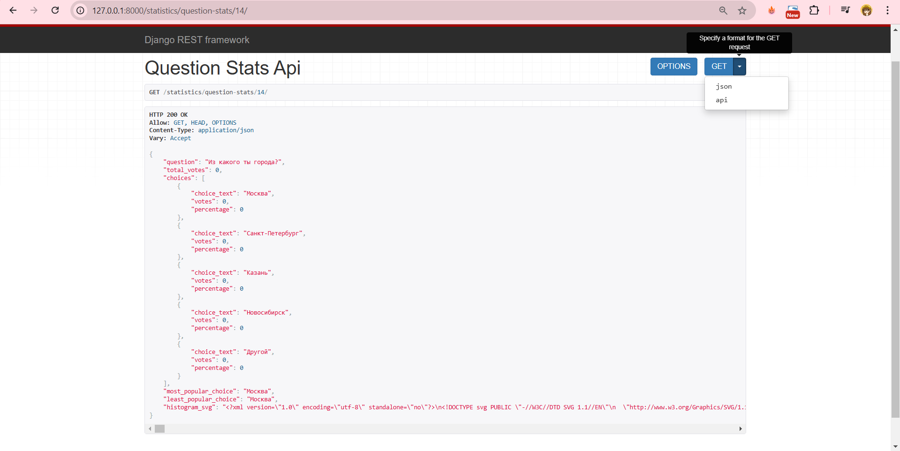
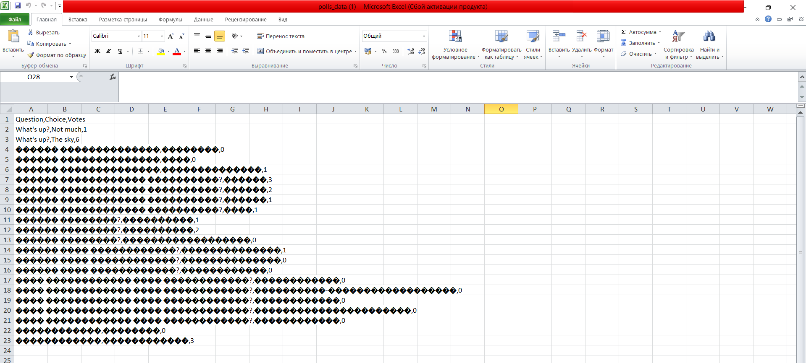

# Лабораторная работа №5. Django REST Framework: (микро)сервисы

Для начала работы настроим файл ```setting.py```, добавив туда:

```python
INSTALLED_APPS = [
    # другие библиотеки
    'django_filters',
    'rest_framework',
    'matplotlib',
]
```

Создание сериализаторов, которые будут преобразовывать данные о голосах в формат JSON. 
```serializers.py```

```python
from rest_framework import serializers
from .models import Question


class QuestionSerializer(serializers.ModelSerializer):
    id = serializers.IntegerField()
    
    class Meta:
        model = Question
        fields = '__all__'
```

Также добавим нужные представления в файл ```views.py```, в частности представления для фильтрации опросов и создания графика:

```python
from rest_framework.views import APIView
from rest_framework.response import Response
from rest_framework import parsers, status
from datetime import datetime, timedelta
from django.utils import timezone
from .serializers import QuestionSerializer
from .models import Question

class QuestionView(APIView):
    parser_classes = (parsers.JSONParser,)

    def post(self, request, format=None):
        request_data = request.data

        # Получение интервала дат
        date_range_provided = ('publication-dates' in request_data) and \
                              ('from' in request_data['publication-dates'] and 'to' in request_data['publication-dates'])
        
        if date_range_provided:
            publication_dates = request_data['publication-dates']
            date_from = datetime.strptime(publication_dates['from'], '%Y-%m-%d').replace(hour=0, minute=0, second=0)
            date_to = datetime.strptime(publication_dates['to'], '%Y-%m-%d').replace(hour=23, minute=59, second=59)
        else:
            date_now = timezone.now()
            date_from = (date_now - timedelta(days=60)).replace(hour=0, minute=0, second=0)
            date_to = date_now.replace(hour=23, minute=59, second=59)

        # Получение диапазона голосов
        votes_range = request_data.get('votes-range', {})
        min_votes = votes_range.get('min', 0)  # По умолчанию 0
        max_votes = votes_range.get('max', float('inf'))  # По умолчанию бесконечность

        # Фильтрация вопросов по дате и количеству голосов
        questions = Question.objects.filter(pub_date__range=[date_from, date_to])
        questions = questions.annotate(total_votes=Sum('choice__votes')).filter(
            total_votes__gte=min_votes,
            total_votes__lte=max_votes
        )

        # Сериализация данных
        question_serializer = QuestionSerializer(questions, many=True)
        
        response_data = {
            'publication-dates': {
                'from': date_from,
                'to': date_to
            },
            'questions': question_serializer.data
        }

        return Response(response_data, status=status.HTTP_200_OK)

from django.utils import timezone
from django.http import JsonResponse
from django.contrib import admin

from rest_framework.views import APIView
from rest_framework.response import Response
from rest_framework import status

from .models import Question, Choice

import matplotlib.pyplot as plt
import matplotlib
matplotlib.use('Agg')  # Используем бэкенд для сохранения изображений без GUI
import io


class QuestionStatsAPIView(APIView):
    def get(self, request, pk):
        try:
            question = Question.objects.get(pk=pk)
        except Question.DoesNotExist:
            return Response("Question does not exist", status=status.HTTP_404_NOT_FOUND)

        choices = question.choice_set.all()
        total_votes = sum(choice.votes for choice in choices)

        stats = {
            'question': question.question_text,
            'total_votes': total_votes,
            'choices': []
        }

        for choice in choices:
            choice_percentage = (choice.votes / total_votes) * 100 if total_votes != 0 else 0
            stats['choices'].append({
                'choice_text': choice.choice_text,
                'votes': choice.votes,
                'percentage': round(choice_percentage, 2)
            })

        most_popular_choice = max(choices, key=lambda choice: choice.votes)
        least_popular_choice = min(choices, key=lambda choice: choice.votes)

        stats['most_popular_choice'] = most_popular_choice.choice_text
        stats['least_popular_choice'] = least_popular_choice.choice_text

        fig, ax = plt.subplots()
        plt.style.use('ggplot')
        ax.bar([choice.choice_text for choice in choices], [choice.votes for choice in choices])
        plt.xticks(rotation=20)
        plt.xlabel('Choices')
        plt.ylabel('Votes')
        plt.title('Votes Distribution')
        plt.subplots_adjust(bottom=0.2)
        buffer = io.BytesIO()
        plt.savefig(buffer, format='svg')
        plt.close(fig)
        buffer.seek(0)

        stats['histogram_svg'] = buffer.getvalue().decode()

        return Response(stats)

import csv
from django.http import HttpResponse

class ExportDataView(APIView):
    def get(self, request, format=None):
        questions = Question.objects.all()
        response = HttpResponse(content_type='text/csv')
        response['Content-Disposition'] = 'attachment; filename="polls_data.csv"'
        
        writer = csv.writer(response)
        writer.writerow(['Question', 'Choice', 'Votes'])
        
        for question in questions:
            for choice in question.choice_set.all():
                writer.writerow([question.question_text, choice.choice_text, choice.votes])
        
        return response
```

И добавим новые маршруты в ```polls/urls.py```:

```python
urlpatterns = [
    # Остальные маршруты
    # Маршруты для статистики
    path("statistics", views.StatisticsView.as_view(), name="statistics"),
    path("statistics-question-list", views.QuestionView.as_view(), name="statistics-question-list"),
    path('statistics/question-stats/<int:pk>/', views.QuestionStatsAPIView.as_view(), name='statistics-question-stats'),
    path('export/', views.ExportDataView.as_view(), name='export_data'),
]

```

Раз у нас появится новая страница с статистикой, создадим для нее отдельный html-шаблон, ```polls/statistics.html```:

```html




<style>
    a.question-link:link, a.question-link:visited {
        background-color: #f44336;
        color: white;
        padding: 15px 25px;
        text-align: center;
        text-decoration: none;
        display: inline-block;
    }

    a.question-link:hover, a.question-link:active {
        background-color: red;
    }

    hr.dates-header {
        height: 4px;
        background-color: black;
        border: none;
    }

    hr.questions-separator {
        height: 2px;
        background-color: brown;
        border: none;
    }
</style>
<div class="container">
    <div class="row">
        <div class="col-md-5" style="border-right: 1px solid #ccc;">
            <h2>Список опросов</h2>

            <div class="form-group">
                <label for="from-date">С:</label>
                <input type="date" class="form-control" id="from-date" required>
            </div>
            <div class="form-group">
                <label for="to-date">До:</label>
                <input type="date" class="form-control" id="to-date" required>
            </div>
            <div class="form-group">
                <label for="min-votes">Минимальное количество голосов:</label>
                <input type="number" class="form-control" id="min-votes" placeholder="Минимум" min="0">
            </div>
            <div class="form-group">
                <label for="max-votes">Максимальное количество голосов:</label>
                <input type="number" class="form-control" id="max-votes" placeholder="Максимум" min="0">
            </div>

            
            <button class="btn btn-primary mt-2" id="submit-btn">Поиск</button>
            <hr class="dates-header">
            <div id="question-list"></div>
        </div>
        <div class="col-md-7">
            <h2>Статистика по опросам</h2>
            <div id="stats-container"></div>
        </div>
    </div>
</div>

<script>
function updateQuestionStatsContainer(data) {
    let container = $('#stats-container');
    container.empty();

    let totalVotes = $('<p>').text('Общее количество голосов: ' + data.total_votes);
    container.append(totalVotes);

    let choices = data.choices;
    let choicesList = $('<ul>');
    choices.forEach(function(choice) {
        let choiceItem = $('<li>').text(choice.choice_text + ' (' + choice.percentage + '%)');
        choicesList.append(choiceItem);
    });
    container.append(choicesList);

    let mostPopularChoice = $('<p>').text('Самый популярный ответ: ' + data.most_popular_choice);
    let leastPopularChoice = $('<p>').text('Самый непопулярный ответ: ' + data.least_popular_choice);
    container.append(mostPopularChoice);
    container.append(leastPopularChoice);

    let svgImage = $('<div>').html(data.histogram_svg);
    container.append(svgImage);
}

function requestQuestionStats(id) {
    let dummyQuestionStatsUrl = '';
    let realQuestionStatsUrl = dummyQuestionStatsUrl.replace('999999999999', id);
    $.ajax({
        url: realQuestionStatsUrl,
        type: 'GET',
        headers: {
            'X-CSRFToken': '{{ csrf_token }}'
        },
        success: function(data) {
            updateQuestionStatsContainer(data);
        },
        error: function() {
            console.log('Error occurred while fetching question stats');
        }
    });
}

$(document).ready(function() {
    let today = new Date();
    let fromDate = new Date(today);
    fromDate.setDate(today.getDate() - 60);
    let toDate = today.toISOString().split('T')[0];

    $('#from-date').val(fromDate.toISOString().split('T')[0]);
    $('#to-date').val(toDate);

    $('#submit-btn').click(function() {
        let fromDate = $('#from-date').val();
        let toDate = $('#to-date').val();
        let minVotes = $('#min-votes').val();
        let maxVotes = $('#max-votes').val();

        let data = {
            'publication-dates': {
                'from': fromDate,
                'to': toDate
            },
            'votes-range': {
                'min': minVotes || 0,
                'max': maxVotes || Number.MAX_SAFE_INTEGER
            }
        };

        $.ajax({
            url: '',
            type: 'POST',
            headers: {
                'X-CSRFToken': '{{ csrf_token }}'
            },
            data: JSON.stringify(data),
            contentType: 'application/json',
            success: function(response) {
                let questions = response.questions;
                $('#question-list').empty();

                questions.forEach(function(question) {
                    let questionHtml = '<div class="question">';
                    questionHtml += `<h6><a id="question-${question.id}" class="question-link" href="#" onclick="requestQuestionStats(${question.id}); return false;">${question.question_text}</a></h6>`;

                    let pubDate = new Date(question.pub_date);
                    let formattedDate = pubDate.toLocaleString('en-US', {
                        year: 'numeric',
                        month: '2-digit',
                        day: '2-digit',
                        hour: '2-digit',
                        minute: '2-digit',
                        second: '2-digit'
                    });
                    questionHtml += '<div style="background-color: white; color: black; padding: 10px;"><p>' + formattedDate + '</p></div>';
                    questionHtml += '</div><hr class="questions-separator">';

                    $('#question-list').append(questionHtml);
                });
            },
            error: function(xhr, status, error) {
                console.error('Error:', error);
            }
        });
    });
});
</script>

```

Но также обновим тег в основном шаблоне ```base_generic.html```:
```html
<script src="https://code.jquery.com/jquery-3.7.1.min.js"></script>
```

Теперь перейдем к скриншотам и тому, как теперь выглядит наше веб-приложение:

Как выглядит страница по адресу http://127.0.0.1:8000/statistics:



Если указать фильтры:



Без указания фильтров сортирует опросы от старого к наиболее свежему:



А так выглядит подробная статистика одного опроса:



Далее перейдем по маршруту http://127.0.0.1:8000/statistics/question-stats/14/:



Если перейти по маршруту http://127.0.0.1:8000/export, то скачается csv файл с результатами всех опросов:




